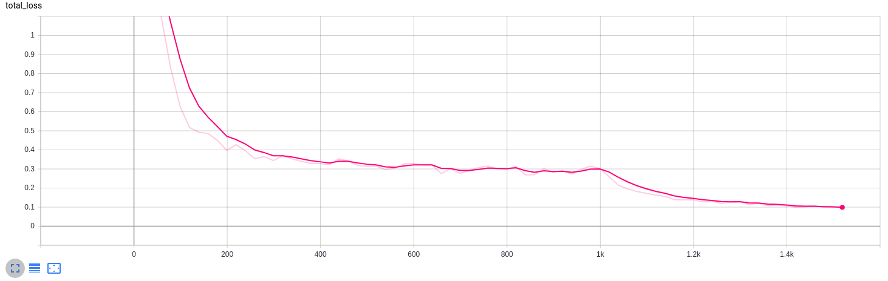
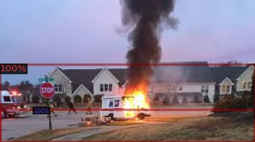
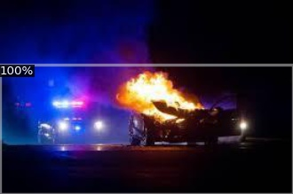
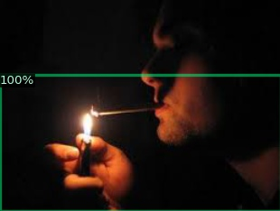

# Test task: Fire detector on Facebook Detectron2 software system
This project is based on Detectron2 framework. The main purpose of the model is to detection fire on any image or video.
It allows us to use it to detect a fire hazard and create an alert.

## Docker build 
```bash
docker image build -t fire-roadar:test . 
```

## Initialization
```bash
docker run -it -p 2021:8888 --name fire_testing -v {fitting_room_data}:/data fitting_room/pose_estimation:test
```

## Create your own dataset
1. Create dataset from xml files -> `src/utils/convert_xml_to_df(dataset_path: str)`
2. Create dataset from pandas DataFrame -> `src/utils/create_dataset_dicts(df: pd.DataFrame, classes: list, data_folder: str)`
3. Register dataset in Detectron2 -> `src/utils/register_data(data_name: str, data_folder: str, csv_name: str)`

## Quick Start
Run Demo
```bash
python demo --output_dir ./reports --model_path {model_path} --input_dir ./data/train --metadata_dir ./data \
  --thresh_tes 0.5 --mode image --opts {add_params}
```
- --output_dir: output folder
- --model_path: model path
- --input_dir: input data folder
- --metadata_dir: data folder with test dataset
- --thresh_test: minimum score threshold (assuming scores in a [0, 1] range), like NMS
- --mode: type of input file [image, video]
- --opts: additional params


## Train
Run trainer
```
python src/train --batch_size 32 --num_workers 4 --max_iter 10000 --lr 0.0001 \
  --output_dir ../reports --model_path COCO-Detection/faster_rcnn_R_50_FPN_3x.yaml \
  --input_dir ../data --checkpoint_step 200 --eval_step 256 \
  --img_size 256 --opts {add_params}
```
- --batch_size: input batch size
- --num_workers number of data loading workers
- --max_iter: number of iterations to train for
- --lr: start learning rate
- --output_dir: output folder
- --model_path: model path
- --input_dir: input data folder
- --checkpoint_step: save period
- --eval_step: evaluation period
- --img_size: min image side size
- --opts: additional params

## Results
Tensorboard:

- Num iterations: 1400
- Basic model: R50-FPN
- Min image size: 256
- AP: 72.50

Sample output of the model:



